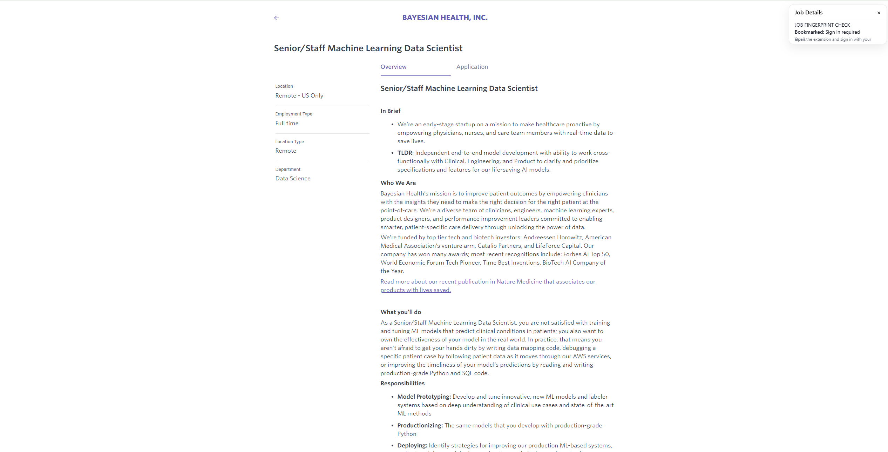

# Job Fingerprint

Job Fingerprint is a browser extension that helps you track and organize your job applications by allowing you to bookmark job posting pages and save them to Supabase. The extension provides an easy way to mark job postings you've applied to and quickly check if you've already bookmarked a particular job posting.

## Features

- 🔖 Quickly bookmark job posting pages with a keyboard shortcut (Alt+A)
- 🔍 Visual indicator showing whether you've already bookmarked a page
- 🔐 Secure authentication using email verification
- ☁️ Cloud storage using Supabase
- 🌐 Works across all websites

## Installation

1. Clone this repository or download the source code
2. Load the extension in your browser:
   - Open your browser's extension management page
   - Enable "Developer mode"
   - Click "Load unpacked"
   - Select the folder containing the extension files

## Usage

1. Click on the Job Fingerprint extension icon in your browser
2. Sign in using your email address (verification code will be sent)
3. Once signed in, you can:
   - Press `Alt+A` on any job posting page to bookmark it
   - Click the extension icon to see your login status
   - The extension will indicate if you've already bookmarked the current page

## Technical Details

The extension is built using:
- Manifest V3 for modern browser extension support
- Supabase for authentication and data storage
- Content scripts for page interaction
- Background service worker for handling browser events

## Files Structure

- `manifest.json` - Extension configuration and permissions
- `popup.html` - Extension popup interface
- `popup.js` - Popup functionality and user interaction
- `content.js` - Content script for page interaction
- `background.js` - Service worker for background tasks
- `config.js` - Configuration settings

## Permissions

The extension requires the following permissions:
- `storage` - For storing user preferences
- `activeTab` - For accessing the current tab's information
- `scripting` - For injecting content scripts
- `tabs` - For tab management
- `commands` - For keyboard shortcut support

## Development

To modify the extension:
1. Make your changes to the source files
2. If you modify the manifest or add new features, make sure to reload the extension
3. Test the changes by loading the unpacked extension in your browser

## Contributing

Feel free to open issues or submit pull requests if you have suggestions for improvements or bug fixes.

## License

This project is open source and available under the MIT License.

